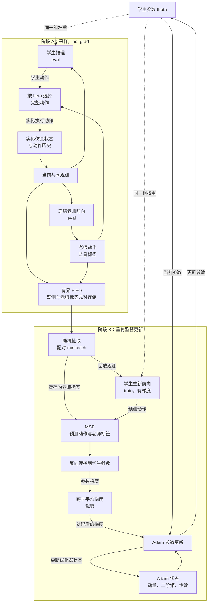

# DAgger 师生蒸馏

这是**第一轮监督学习**的通用训练包：老师冻结并提供动作标签，学生通过仿真交互
收集自身会遇到的状态，再学习老师在这些状态上的动作。不执行 PPO，也不自动进入第二轮探索。

本包不绑定 G1、RGMT 或某个 checkpoint。机器人环境、模型结构、
老师文件和学生配方由调用方提供。G1 项目入口是 [scripts/distill_dagger.py](../../../scripts/distill_dagger.py)。

## 目录职责

| 文件 | 职责 |
|---|---|
| [models.py](models.py) | `ModelSpec` 与 `resolve_model_config`：统一配置解析、模型构造与严格权重加载 |
| [trainer.py](trainer.py) | `DaggerConfig`、环境协议、训练循环、日志、保存和续训 |
| [replay.py](replay.py) | 有界 FIFO 样本缓存、老师接管概率、跨进程梯度平均 |
| [__init__.py](__init__.py) | 公开 `ModelSpec`、`DaggerConfig`、`run_distillation` |

职责以状态所有者划分：模型结构由 factory 解释，学生/老师生命周期由训练器管理，
机器人配置由项目脚本提供。RGMT 特有的 `initialize_student` 放在项目脚本中，
只复制学生的兼容编码器，不修改老师；老师冻结由训练器统一负责。

旧的 `g1_lower_rl.rl.dagger` 转发模块已删除。缓存与同步工具直接从
`g1_lower_rl.rl.distillation.replay` 导入；checkpoint 的字段和续训格式保持不变。
配置解析复用同一实现，显式空字典不会被当作缺省配置。资源通过标准库 `ExitStack`
统一清理，即使某个关闭操作失败，也会尝试关闭剩余资源。

## 一轮训练的数据流



- 实线表示数据或更新流，虚线表示前向计算使用的参数。采样和监督更新按阶段交替，不同时执行。
- 两个学生节点是**同一个模型的两次用途**，不是两套网络：采样时无梯度推理，
    更新时用当前权重对回放观测重新前向。缓存不保存学生预测，也不保留采样时的计算图。
- MSE 的两个输入是学生预测和老师标签。MSE 经反向传播产生梯度；Adam 再结合
    梯度、当前参数和优化器状态更新学生，不直接拿动作标签更新参数。
- 老师和学生读取**同一个实际状态**。执行动作可以来自任意一方，监督标签始终来自老师。
- `beta` 按环境、按控制步决定执行哪一方的**完整动作向量**，不是逐关节混搭或动作插值。
- 学生独立控制用于暴露自己的偏差，不等于 PPO 自主探索。
- 在 `env.step` 前复制观测和标签，避免环境更新张量后发生标签错配。
- 优化目标是动作 MSE；环境奖励、复位率和任务指标仅记录，不参与反向传播。

## 最小 CPU 示例

从仓库根目录的现有 Python 环境运行下面示例即可验证接口。它使用**随机老师和玩具环境**，
只演示如何配置不同网络宽度，不代表实际机器人策略或有意义的控制任务。
输出写入临时目录，离开代码块中的上下文后自动清理，不触碰已有训练目录。

```python
import tempfile
from pathlib import Path

import torch
from tensordict import TensorDict
from torch import nn

from g1_lower_rl.rl.distillation import DaggerConfig, ModelSpec, run_distillation


class Policy(nn.Module):
    def __init__(self, input_dim, hidden_dim, action_dim):
        super().__init__()
        self.net = nn.Sequential(
            nn.Linear(input_dim, hidden_dim), nn.Tanh(),
            nn.Linear(hidden_dim, action_dim),
        )

    def forward(self, observations):
        return self.net(observations["state"])


def build_policy(observations, config):
    return Policy(observations["state"].shape[-1], **config)


class ToyEnv:
    num_envs = 4

    def __init__(self, device, seed):
        self.state = torch.ones(self.num_envs, 3, device=device)

    def reset(self):
        observations = TensorDict({"state": self.state.clone()}, batch_size=[self.num_envs])
        return observations, {}

    def step(self, actions):
        self.state[:, :2] = actions.detach().clamp(-2, 2)
        observations, _ = self.reset()
        rewards = self.state.new_zeros(self.num_envs)
        dones = torch.zeros(self.num_envs, device=self.state.device, dtype=torch.bool)
        return observations, rewards, dones, {}

    def close(self):
        pass


teacher = ModelSpec(build_policy, {"hidden_dim": 32, "action_dim": 2})
student = ModelSpec(build_policy, {"hidden_dim": 8, "action_dim": 2})
training = DaggerConfig(
    device="cpu", iterations=3, rollout_steps=2, teacher_steps=1,
    replay_capacity=32, batch_size=8, updates_per_iteration=2, save_interval=1,
)
with tempfile.TemporaryDirectory() as directory:
    checkpoint = run_distillation(
        environment_factory=ToyEnv,
        teacher_spec=teacher,
        student_spec=student,
        config=training,
        output_dir=Path(directory) / "run",
    )
    assert checkpoint.is_file()
    print(checkpoint.name)
```

## 模型配置与检查点

`ModelSpec` 的参数如下：

| 参数 | 含义 |
|---|---|
| `factory` | `factory(observations, config) -> nn.Module`，由应用提供 |
| `config` | 模型配置字典；内容由 factory 自行解释，不要求固定键名 |
| `checkpoint` | 可选的可信本地权重文件 |
| `state_key` | 权重在文件中的键名，默认 `actor_state_dict` |

`build(observations, device)` 返回 `(model, resolved_config)`，使用 `strict=True` 加载权重。
配置按以下优先级选择：

1. 显式 `ModelSpec.config`。
2. checkpoint 顶层的 `model_config`。
3. 旧蒸馏 checkpoint 的 `infos.distillation.actor_config`。
4. 都没有则报错，不猜测网络结构。

**配置可以省略，但 factory 不能省略。** 单独的 state_dict 不足以恢复激活函数、
注意力头数或计算图。即使文件包含配置，也仍由 factory 解释它。
新 checkpoint 保存配置，不保存 Python 构造函数。配置需可 JSON 序列化。
没有 SHA-256 校验；`torch.load(..., weights_only=False)` 仅应用于可信文件。

使用上面示例定义的 `build_policy`，实际老师与学生可这样配置：

```python
teacher = ModelSpec(
    factory=build_policy,
    config={"hidden_dim": 32, "action_dim": 2},
    checkpoint="teacher.pt",
)
student = ModelSpec(factory=build_policy, checkpoint="student_with_model_config.pt")
```

上面两个文件需由调用方提供，配置必须与权重匹配。不同模型家族也可使用不同 factory，
但师生的动作维度、关节顺序、单位、缩放和语义必须相同。

## 环境与模型约定

`environment_factory(device, seed)` 返回符合 [DistillationEnv](trainer.py) 的环境：

| 成员 | 约定 |
|---|---|
| `num_envs` | 本进程环境数量 |
| `reset()` | 返回 `(observations, extras)` |
| `step(actions)` | 返回 `(observations, rewards, dones, extras)` |
| `close()` | 释放本进程环境资源 |

- `observations` 是 TensorDict，各选定项为 `[num_envs, features]` 的浮点张量。
- 师生均接收所选观测项，并输出 `[num_envs, action_dim]` 的浮点动作张量。
- 模型必须提供确定性 forward；训练器不会调用模型特有的随机采样接口。
- 各张量应位于当前设备上，奖励与 done 按环境提供；done 包括环境的复位/超时逻辑。
- 环境适配器负责终止后的复位，训练器不会按 done 单独调用局部 reset。
- 动作历史由环境记录**实际执行的动作**，不能记录老师未执行的假想动作。
- 通用包不施加动作裁剪或改变参考播放速度；这些属于环境适配器。
- 目前不管理循环模型隐状态，也不支持回放图像/多维观测。显式历史可以展平为二维观测。

## 训练参数

| `DaggerConfig` 参数 | 默认值 | 口径 |
|---|---:|---|
| `iterations` | 1000 | 本次新增监督轮数，不是累计目标 |
| `rollout_steps` | 24 | 每轮每环境采样步数，实际步长由环境定义 |
| `teacher_steps` | 200 | 从累计第 0 轮开始，老师接管概率线性降至零；非正值表示零接管 |
| `replay_capacity` | 65536 | 每卡观测/标签对的最大保留数量 |
| `batch_size` | 2048 | 每卡每次监督更新的样本数，有放回采样 |
| `updates_per_iteration` | 12 | 每次 rollout 后的梯度更新次数，不是全库 epoch |
| `learning_rate` | 0.0003 | 新 Adam 的学习率；续训以存档优化器为准 |
| `save_interval` | 100 | 按累计轮次保存；起点和终点也保存 |
| `seed` | 42 | 各进程使用 `seed + rank` |
| `device` | `cuda:0` | 单进程设备；NCCL 多进程按 LOCAL_RANK 选择 GPU |
| `observation_keys` | `None` | 默认选择所有观测项；显式元组用于排除 critic 等特权输入 |

每轮每卡新增样本数为 `num_envs * rollout_steps`。例如 256 环境、24 步与 65536
容量只保留最近约 10.7 轮样本。**当前使用有界 FIFO，不是全历史聚合或蓄水池采样。**

## 可选回调

| 参数 | 作用 |
|---|---|
| `initialize(teacher, student)` | 新学生的参数迁移策略；有学生 checkpoint 或 resume 时不执行 |
| `metrics_fn(env)` | 返回指标名到当前设备标量张量的字典，仅用于诊断 |
| `metadata_fn(env)` | 环境创建后补充库大小等 JSON 可序列化信息 |
| `metadata` | 应用级运行说明，不能存入对象或函数 |
| `checkpoint_extras` | 附加 critic 等内容，不能覆盖训练器保留字段 |

`initialize` 应只修改学生，不修改老师；老师整个网络被冻结且处于 eval 模式。
探索分布等学生特有参数由 factory 冻结，通用包不会识别 `distribution`、`mlp`
或 `encoder` 等内部属性。没有迁移回调时，学生只按 factory 或 checkpoint 初始化。

任务指标不要覆盖 `online_label_mse`、`teacher_fraction`、`reward`、`done_fraction`。
多进程回调必须返回相同顺序的相同键，否则 collective 调用无法正确对齐。
metadata 回调也不要覆盖训练器的状态、阶段和预算字段。

## 初始化与续训

**只加载学生权重：** 设置 `student_spec.checkpoint`，不传 `resume_checkpoint`。
创建新的 Adam，监督轮次从 0 开始。这不是断点续训。

**继续 DAgger：** 传入 `resume_checkpoint`，恢复 `actor_state_dict`、
`dagger_optimizer_state_dict`、`dagger_iteration`。学生模型仍需由 `student_spec`
构造，可以把同一路径交给 `ModelSpec` 以读取内嵌配置。恢复时严格匹配形状。

例如从 1000 轮恢复、`iterations=10000`，目标是 11000；若 `teacher_steps=200`，
续训从一开始就是零老师接管，但老师仍逐步提供标签。老师由本次 teacher_spec 选择，
允许与历史老师不同；这种改变的训练意义由调用方负责。

不恢复回放数据、仿真状态、随机数状态。旧存档中的版本/哈希字段不限制加载。
通用包的 resume 固定读取上述 DAgger 键，不能用于任意外部优化器检查点。
本次必须使用**不存在的新输出目录**，即使是续训也不覆盖原运行目录。

## 输出与指标

```text
output_dir/
  run.json
  metrics.jsonl
  events.out.tfevents.*
  model_dagger_000000.pt
  model_dagger_000100.pt
  ...
  rank_1/
    run.json
    metrics.jsonl
    events.out.tfevents.*
```

模型只由 rank 0 保存，采用临时文件加原子替换。新 checkpoint 包含：
`actor_state_dict`、`model_config`、`dagger_optimizer_state_dict`、`dagger_iteration`、
`infos.distillation`；`iter=0` 是为与仓库 PPO 格式交接，不是 DAgger 训练轮次。
critic 不是通用包必需项。完成状态在最终 `run.json` 中查看，模型中的元数据是保存时快照。

| 指标 | 含义 |
|---|---|
| `online_label_mse` | 本轮优化前、刚采集状态上的师生动作差距 |
| `train_mse` | 本轮回放批次监督更新的平均损失 |
| `teacher_fraction` | 本轮实际选择老师动作的环境步比例 |
| `beta` | 本轮老师接管的目标概率 |
| `reward` | 仿真返回的平均奖励，仅用于诊断 |
| `done_fraction` | 每步复位/超时比例，不是整段动作失败率 |
| `replay_size` | 单卡有效缓存量，不是双卡之和 |
| `elapsed_s` | 本次初始化完成后的耗时，不含加载和历史运行耗时 |

两项 MSE 都不是固定验证集误差，因为学生采到的状态在变化。`completed` 仅表示预算完成，
不代表收敛或可部署。需要另做固定数据和闭环师生评测，再决定是否开始第二轮 PPO。

## 双卡行为

项目入口仍可用 `torchrun`/`torch.distributed.run --nproc_per_node=2` 启动；所有进程
需使用相同的显式 output_dir。默认创建 NCCL 进程组，每卡独立仿真和缓存，先顺序加载
环境降低主机内存峰值，再并行采样和优化。

初始模型状态广播，训练时手动 all-reduce 平均梯度，之后做相同裁剪与 Adam 更新。
不是两个互不相关的学生。保存时检查学生参数一致以及老师 state_dict 未变化。
各 rank 必须有相同参数顺序、相同梯度结构和相同更新次数；任意条件分支模型不保证支持。
学生模型的运行时缓冲（例如 BatchNorm 统计）不在每次更新后同步，需要应用自行处理。

若调用方已初始化进程组，本包复用且不销毁它；只清理自己创建的进程组。
CPU 多进程需要调用方预先建立 Gloo 进程组，不能用默认 torchrun 初始化路径代替。

## 验证与范围

在仓库根目录，可只用 CPU 运行测试：

```bash
CUDA_VISIBLE_DEVICES='' OMP_NUM_THREADS=1 micromamba run -n mj python -m unittest discover -s tests -p 'test_distillation*.py' -v
```

覆盖自定义动作维度、配置恢复、严格加载、监督更新、Adam 续训、异常关闭和 Gloo 双进程同步。
本次抽包没有重跑 GPU/NCCL 集成测试，以免干扰现有训练。代码修改不意味着运行中的
Python 进程会热加载新模块；使用新入口需要之后单独启动新任务。